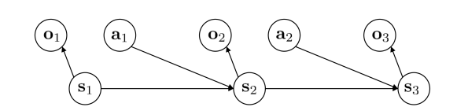

# Chapter 1: Introduction to Reinforcement Learning

Reinforcement Learning is a paradigm in machine learning where an agent learns to make sequential decisions through interaction with an environment. Unlike supervised learning, where the agent learns from labeled examples, or unsupervised learning, where it learns patterns from unlabeled data, reinforcement learning is driven by the goal of maximizing cumulative reward through trial and error. The agent is not told which actions to take but must discover them by exploring the consequences of its actions.

Sequential decision-making under uncertainty is at the heart of reinforcement learning. The agent must balance exploration and exploitation. Exploration is needed to gather information about the environment, while exploitation uses this information to select actions that appear best.

```text
 RL vs Supervised Learning (Key Differences)
       ┌─────────────────────────────────────────────────────┐
       │ Supervised Learning:                                │
       │   – Learns from labeled examples (input → target)   │
       │   – Feedback is immediate and correct               │
       │   – IID data; no sequential dependence              │
       │                                                     │
       │ Reinforcement Learning:                             │
       │   – Learns from interaction (trial & error)         │
       │   – Feedback (reward) may be delayed or sparse      │
       │   – Data depends on agent's actions (non-IID)       │
       │   – Must balance exploration vs exploitation        │
       │   – Must solve temporal credit assignment           │
       └─────────────────────────────────────────────────────┘
```    
   
A key characteristic of reinforcement learning is that the outcome of an action may not be immediately known. Rewards can be delayed, making it hard to determine which past actions are responsible for future outcomes. This challenge is known as temporal credit assignment. Successful reinforcement learning algorithms must learn to attribute long-term consequences to earlier decisions.

At each time step, the agent observes some representation of the world, takes an action, and receives a reward. The world then transitions to a new state. This interaction continues over time, forming an experience trajectory:

$$
s_0, a_0, r_1, s_1, a_1, r_2, \dots
$$

- State $s_t$: the (true) state of the environment at time $t$, containing all information needed to determine future dynamics (Markov property).

- Observation $o_t$: the information perceived by the agent at time $t$. In partially observable settings, the agent does not have direct access to the true state and only observes $o_t$.

- Action $a_t$: the action chosen by the agent at time $t$.

- Trajectory $\tau$: a sequence of states (or observations), actions, and rewards generated by interaction with the environment, e.g.  $\tau = (s_0, a_0, r_0, s_1, a_1, r_1, \dots)$  (or using observations instead of states).

- Reward function $r(s_t, a_t, s_{t+1})$ (often written as $r_t$): a scalar feedback signal indicating how good the outcome of taking action $a_t$ in state $s_t$ is. In practice, it may depend on the next state as well.


> The Markov property states that the future state $s_{t+1}$ depends only on the current state $s_t$ and action $a_t$, not on any earlier states or actions:
>
> $$P(s_{t+1} \mid s_t, a_t, s_{t-1}, a_{t-1}, \dots) = P(s_{t+1} \mid s_t, a_t)$$
>
> Given the current state, all past states or actions are irrelevant for predicting the next state. For example, $s_2$ depends only on $s_1$ and $a_1$, not on $s_0$.
>
> 
>
> Observations $o_t$ only have partial information about the state. Knowing only $o_t$ may require the full history to predict $s_{t+1}$.
> If you only have observations $o$, the policy needs memory over the past $m$ or all the  observations can be written as:
>
> $$\pi_\theta(a_t \mid o_{t-m}, \dots, o_t)$$
>

The agent’s goal is to learn a policy, which is a mapping from states to actions, that maximizes the total reward it collects over time. The total future reward is defined through the notion of return. The most common formulation is the discounted return:

$$
G_t = r_{t+1} + \gamma r_{t+2} + \gamma^2 r_{t+3} + \dots
$$

where $0 \le \gamma \le 1$ is called the discount factor. It determines how much the agent values immediate rewards compared to future rewards. A smaller $\gamma$ encourages short-term decisions, while a larger $\gamma$ favors long-term planning.

> The goal of reinforcement learning (RL) is to maximize the cumulative reward over time, typically expressed as:
>
> $$\max \sum_{t=0}^{T} r(s_t, a_t)$$
>
> However, this quantity is not deterministic. There are several sources of variability that make the cumulative reward stochastic:

> 1. Environment Stochasticity -  The environment may have inherent randomness, e.g., state transitions are probabilistic: $s_{t+1} \sim P(s_{t+1} \mid s_t, a_t)$. Even if the policy is fixed, different runs may produce different trajectories.
>
> 2. Policy Stochasticity The agent may follow a stochastic policy: $a_t \sim \pi(a_t \mid s_t)$This introduces randomness in the actions chosen at each state.
> Together, these sources make the total reward a random variable, and RL typically focuses on maximizing its expected value:
>
>$$
>\max_\theta \mathbb{E_{\tau \sim p_{\theta}(\tau)}}\Big[\sum_{t=0}^{T} r(s_t, a_t)\Big]
>$$


Reinforcement learning involves four fundamental challenges:

1. Optimization: The agent must find an optimal policy that maximizes expected return.
2. Delayed consequences: Actions can affect rewards far into the future, making credit assignment difficult.
3. Exploration: The agent must try actions to learn their consequences, even though some actions may seem suboptimal in the short term.
4. Generalization: The agent must use limited experience to generalize to states it has never seen before.

The main components of a reinforcement learning system are the agent, the environment, actions, states, and rewards. The agent chooses an action based on its current state. The environment responds with the next state and a reward. From this interaction, the agent must infer how to improve its decisions over time.

The concept of state is crucial. A state is a summary of information that can influence future outcomes. In theory, a state is Markov if it satisfies:

$$
p(s_{t+1} | s_t, a_t) = p(s_{t+1} | h_t, a_t)
$$

where $h_t$ is the full history of past observations, actions, and rewards. This means that the future depends only on the current state, not on the entire past. The Markov property is important because it simplifies the learning problem and allows powerful mathematical tools to be applied.

> State (environment)  →  Action (agent)  →  Next State (environment)


Reinforcement learning is particularly useful in domains where optimal behavior is not easily specified, data is limited or must be collected through interaction, and long-term consequences matter. Examples include robotics, autonomous vehicles, game playing, resource allocation, recommendation systems, and online decision-making.

## Key Concepts:

### Episodic vs Continuing:
Reinforcement learning problems can be episodic or continuing. In episodic tasks, interactions end after a finite number of steps, and the agent resets for a new episode. In continuing tasks, the interactions never formally end, and the agent must learn to behave well indefinitely. In episodic settings, the return is naturally finite. In continuing tasks, discounting or average reward formulations are used to ensure the return is well-defined.


### Types of RL tasks:
There are several types of learning tasks in RL:

1. Prediction/Policy Evaluation: Estimating how good a given policy is.
2. Control: Finding an optimal policy that maximizes expected return.
3. Planning: Computing optimal policies using a known model of the environment.

### Model based vs Model-free
Reinforcement learning algorithms can be classified into two major categories: model-based and model-free. Model-based methods assume that the transition dynamics and reward function of the environment are known or learned. They use this information for planning. Model-free methods do not assume access to this knowledge and must learn directly from interaction.

### On-policy vs off-policy

* On-policy learning:
    - Direct experience.
    - Learn to estimate and evaluate a policy from experience obtained from following that policy.

* Off-policy Learning
    - Learn to estimate and evaluate a policy using experience gathered from following a different policy.

### Tabular vs Function Approximation

In small environments with a limited number of states and actions, value functions and policies can be represented using tables. This is known as the tabular setting. However, real-world problems often involve very large or continuous state spaces, where it is impossible to maintain a separate entry for every state or action.

In such cases, we approximate the value function or policy using a parameterized function, such as a linear model or neural network. This approach is called function approximation. Function approximation enables generalization: knowledge gained from one state can be applied to many similar states, making learning feasible in large or continuous environments.

> ### Types of Reinforcement Learning Algorithms
> 
> 1. Imitation Learning - Mimic a policy that achieves high reward.
> 2. Policy Gradients - Directly differentiate the objective to improve the policy.
> 3. Actor-Critic - Estimate the value of the current policy and use it to make the policy better.
> 4. Value-Based - Estimate the value of the optimal policy.
> 5. Model-Based - Learn to model the dynamics of the environment and use it for planning or policy improvement.
>
> ## Why Are There So Many RL Algorithms?
> - Data collection cost / ease: How easy or cheap is it to collect data with the policy?   *Example: simulator vs. real-world / hand-written policies.*
> - Supervision type / cost: How easy or cheap are different forms of supervision? *Example: demonstrations, dense rewards, sparse rewards.*
> - Stability and ease-of-use: How important is the stability of training and the ease of tuning the algorithm?
> - Action space: Dimensionality and type of actions. *Example: continuous vs. discrete action spaces.*
> - Dynamics model learnability: How easy is it to learn or approximate the environment dynamics?

