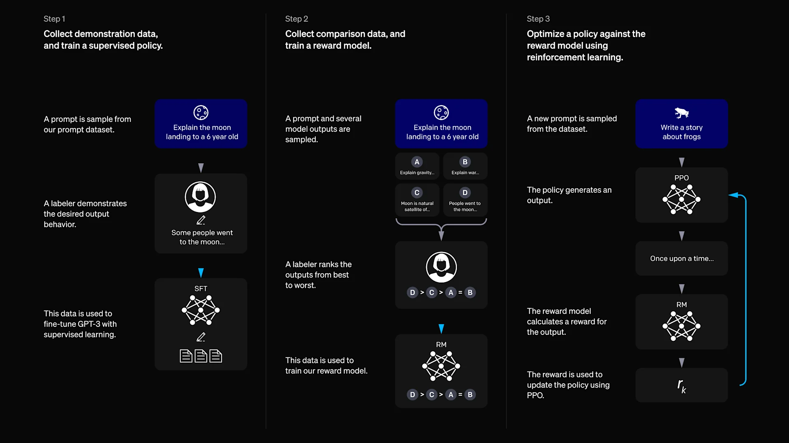

# Chapter 9: Reinforcement Learning from Human Feedback and Value Alignment


Designing a reward function that captures exactly what we want from a  model is extremely difficult. In open-ended tasks such as in langugae models for dialogue or summarization, we cannot easily hand-craft a numeric reward for “good” behavior. This is where Reinforcement Learning from Human Feedback (RLHF) comes in. RLHF is a strategy to achieve value alignment – ensuring an AI’s behavior aligns with human preferences and values – by using human feedback as the source of reward. Instead of explicitly writing a reward function, we ask humans to compare or rank outputs, and use those preferences as a training signal. Humans find it much easier to choose which of two responses is better than to define a precise numerical reward for each outcome. For example, it's simpler for a person to say which of two summaries is more accurate and polite than to assign an absolute “score” to a single summary. By leveraging these relative judgments, RLHF turns human preference data into a reward model that guides the training of our policy (the language model) toward preferred behaviors.

Pairwise preference is an intermediary point between humans having to label the correct action at every step, as in DAgger, and having to provide very dense, hand-crafted rewards. Instead of specifying what the right action is at each moment or assigning numeric rewards, humans simply compare two outputs and indicate which one they prefer. This makes the feedback process much more natural and less burdensome, while still providing a meaningful training signal beyond raw demonstrations.

## Bradley–Terry Preference Modeling in RLHF

To convert human pairwise preferences into a learnable reward signal, RLHF commonly relies on the Bradley–Terry model, a probabilistic model for noisy comparisons. 

Consider a $K$-armed bandit with actions $b_1, b_2, \dots, b_K$, and no state or context. A human provides noisy pairwise comparisons between actions. The probability that the human prefers action $b_i$ over $b_j$ is modeled as:

$$
P(b_i \succ b_j)
=
\frac{\exp(r(b_i))}{\exp(r(b_i)) + \exp(r(b_j))}
=
p_{ij}
$$

where $r(b)$ is an unobserved scalar reward associated with action $b$. Higher reward implies a higher probability of being preferred, but comparisons remain stochastic to reflect human noise and ambiguity.


Assume we collect a dataset $\mathcal{D}$ of $N$ comparisons of the form $(b_i, b_j, \mu)$, where:

- $\mu(1) = 1$ if the human marked $b_i \succ b_j$
- $\mu(1) = 0.5$ if the human marked $b_i = b_j$
- $\mu(1) = 0$ if the human marked $b_j \succ b_i$

We fit the reward model by maximizing the likelihood of these observations, which corresponds to minimizing the cross-entropy loss:

$$
\mathcal{L}
=
-
\sum_{(b_i,b_j,\mu)\in\mathcal{D}}
\left[
\mu(1)\log P(b_i \succ b_j)
+
\mu(2)\log P(b_j \succ b_i)
\right]
$$

Optimizing this loss adjusts the reward function $r(\cdot)$ so that preferred outputs receive higher scores than dispreferred ones. This learned reward model then serves as a surrogate for human preferences.

Once the reward model is trained using the Bradley–Terry objective, it can be plugged into the RLHF pipeline. In the standard approach, the policy (language model) is optimized with PPO to maximize the learned reward while remaining close to a reference model. Conceptually, the Bradley–Terry model is the critical bridge: it translates qualitative human judgments into a quantitative reward function that reinforcement learning algorithms can optimize.


## The RLHF Training Pipeline



To train a language model with human feedback, practitioners usually follow a three-stage pipeline. Each stage uses a different training paradigm (supervised learning or reinforcement learning) to gradually align the model with what humans prefer:

1. Supervised Fine-Tuning (SFT) – Start with a pretrained model and fine-tune it on demonstrations of the desired behavior. For example, using a dataset of high-quality question-answer pairs or summaries written by humans, we train the model to imitate these responses. This teacher forcing stage grounds the model in roughly the right style and tone (as discussed in earlier chapters on imitation learning). By the end of SFT, the model (often called the reference model) is a strong starting point that produces decent responses, but it may not perfectly adhere to all subtle preferences or values because it was only trained to imitate the data.

2. Reward Model Training from Human Preferences – Next, we collect human feedback in the form of pairwise preference comparisons. For many prompts, humans are shown two model-generated responses and asked which one is better (or if they are equally good). From these comparisons, we learn a reward function $r_\phi(x,y)$ (parameterized by $\phi$) that predicts which response is more preferable for a given input x using Bradley–Terry model.

3. Reinforcement Learning Fine-Tuning – In the final stage, we use the learned reward model as a surrogate reward signal to fine-tune the policy (the language model) via reinforcement learning. The policy $\pi_\theta(y|x)$ (with parameters $\theta$) is updated to maximize the expected reward $r_\phi(x,y)$ of its outputs, while also staying close to the behavior of the reference model from stage 1. This last point is crucial: if we purely maximize the reward model’s score, the policy might exploit flaws in $r_\phi$ (a form of “reward hacking”) or produce unnatural outputs that, for example, repeat certain high-reward phrases. To prevent the policy from straying too far, RLHF algorithms introduce a Kullback–Leibler (KL) penalty that keeps the new policy $\pi_\theta$ close to the reference policy $\pi_{\text{ref}}$ (often the SFT model). In summary, the RL objective can be written as:
 
    $$\max_{\pi_\theta} (
    \underbrace{
    \mathbb{E}_{x \sim \mathcal{D},\, y \sim \pi_\theta(y \mid x)}
    }_{\text{Sample from policy}}
    \left[
    \underbrace{
    r_\phi(x,y)
    }_{\text{Want high reward}}
    \right]
    -
    \underbrace{
    \beta \, \mathbb{D}_{\mathrm{KL}}
    \left[
    \pi_\theta(y \mid x) \,\|\, \pi_{\mathrm{ref}}(y \mid x)
    \right]
    }_{\text{Keep KL to original model small}})
    $$


    where $\beta>0$ controls the strength of the penalty. Intuitively, this objective asks the new policy to generate high-reward answers on the training prompts, but it subtracts points if $\pi_\theta$ deviates too much from the original model’s distribution (as measured by KL divergence). The KL term thus acts as a regularizer encouraging conservatism: the policy should only change as needed to gain reward, and not forget its broadly learned language skills or go out-of-distribution. In practice, this RL optimization is performed using Proximal Policy Optimization (PPO) (introduced in Chapter 7) or a similar policy gradient method. PPO is well-suited here because it naturally limits the size of each policy update (via the clipping mechanism), complementing the KL penalty to maintain stability.

Through this pipeline – SFT, reward modeling, and RL fine-tuning – we obtain a policy that hopefully excels at the task as defined implicitly by human preferences. Indeed, RLHF has enabled large language models to better follow instructions, avoid blatantly harmful content, and generally be more helpful and aligned with user expectations than they would be out-of-the-box. That said, the full RLHF procedure involves training multiple models (a reward model and the policy) and carefully tuning hyperparameters (like $\beta$ and PPO clip thresholds). The process can be unstable; for instance, if $\beta$ is too low, the policy might mode-collapse to only a narrow set of high-reward answers, whereas if $\beta$ is too high, the policy might hardly improve at all. Researchers have described RLHF as a “complex and often unstable procedure” that requires balancing between reward optimization and avoiding model drift. This complexity has spurred interest in whether we can achieve similar alignment benefits without a full reinforcement learning loop. 

## Direct Preference Optimization: RLHF without RL?

Direct Preference Optimization (DPO) is a recently introduced alternative to the standard RLHF fine-tuning stage. The key idea of DPO is to solve the RLHF objective in closed-form, and then optimize that solution directly via supervised learning. DPO manages to sidestep the need for sampling-based RL (like PPO) by leveraging the mathematical structure of the RLHF objective we defined above.

Recall that in the RLHF setting, our goal is to find a policy $\pi^*(y|x)$ that maximizes reward while staying close to a reference policy. Conceptually, we can write the optimal policy for a given reward function in a Boltzmann (exponential) form. In fact, it can be shown (see e.g. prior work on KL-regularized RL) that the optimizer of $J(\pi)$ occurs when $\pi$ is proportional to the reference policy times an exponential of the reward:

$$\pi^*(y \mid x) \propto \pi_{\text{ref}}(y \mid x)\,
\exp\!\left(\frac{1}{\beta}\, r_\phi(x, y)\right)$$

This equation gives a closed-form solution for the optimal policy in terms of the reward function $r_\phi$. It makes sense: actions $y$ that have higher human-derived reward should be taken with higher probability, but we temper this by $\beta$ and weight by the reference probabilities $\pi_{\text{ref}}(y|x)$ so that we don’t stray too far. If we were to normalize the right-hand side, we’d write:

$$\pi^*(y \mid x)
=
\frac{
\pi_{\text{ref}}(y \mid x)\,
\exp\!\left(\frac{r_\phi(x,y)}{\beta}\right)
}{
\sum_{y'} \pi_{\text{ref}}(y' \mid x)\,
\exp\!\left(\frac{r_\phi(x,y')}{\beta}\right)
}$$

Here the denominator is a partition functionsumming over all possible responses $y'$ for input $x$. This normalization involves a sum over the entire response space, which is astronomically large for language models – hence we cannot directly compute $\pi^*(y|x)$ in practice. This intractable sum is exactly why the original RLHF approach uses sampling-based optimization (PPO updates) to approximate the effect of this solution without computing it explicitly.

DPO’s insight is that although we cannot evaluate the normalizing constant easily, we can still work with relative probabilities. In particular, for any two candidate responses $y_+$ (preferred) and $y_-$ (dispreferred) for the same context $x$, the normalization cancels out if we look at the ratio of the optimal policy probabilities. Using the form above:


$$\frac{\pi^*(y^+ \mid x)}{\pi^\ast(y^- \mid x)}
=
\frac{\pi_{\text{ref}}(y^+ \mid x)\,
\exp\!\left(\frac{r_\phi(x, y^+)}{\beta}\right)}
{\pi_{\text{ref}}(y^- \mid x)\,
\exp\!\left(\frac{r_\phi(x, y^-)}{\beta}\right)}
=
\frac{\pi_{\text{ref}}(y^+ \mid x)}
{\pi_{\text{ref}}(y^- \mid x)}
\exp\!\left(
\frac{1}{\beta}
\big[
r_\phi(x, y^+) - r_\phi(x, y^-)
\big]
\right)$$

Taking the log of both sides, we get a neat relationship:

$$\frac{1}{\beta}
\big( r_\phi(x, y^{+}) - r_\phi(x, y^{-}) \big)
=
\big[ \log \pi^\ast(y^{+} \mid x) - \log \pi^\ast(y^{-} \mid x) \big]
-
\big[ \log \pi_{\text{ref}}(y^{+} \mid x) - \log \pi_{\text{ref}}(y^{-} \mid x) \big]$$

The term in brackets on the right is the difference in log-probabilities that the optimal policy $\pi^*$ assigns to the two responses (which in turn would equal the difference in our learned policy’s log-probabilities if we can achieve optimality). What this equation tells us is: the difference in reward between a preferred and a rejected response equals the difference in log odds under the optimal policy (minus a known term from the reference model). In other words, if $y_+$ is better than $y_-$ by some amount of reward, then the optimal policy should tilt its probabilities in favor of $y_+$ by a corresponding factor.

Crucially, the troublesome normalization is gone in this ratio. We can rearrange this relationship to directly solve for policy probabilities in terms of rewards, or vice-versa. DPO leverages this to cut out the middleman (explicit RL). Instead of updating the policy via trial-and-error with PPO, DPO directly adjusts $\pi_\theta$ to satisfy these pairwise preference constraints. Specifically, DPO treats the problem as a binary classification: given a context $x$ and two candidate outputs $y_+$ (human-preferred) and $y_-$ (human-dispreferred), we want the model to assign a higher probability to $y_+$ than to $y_-$, with a confidence that grows with the margin of preference. We can achieve this by maximizing the log-likelihood of the human preferences under a sigmoid model of the log-probability difference.

In practice, the DPO loss for a pair $(x, y_+, y_-)$ is something like:

$$\ell_{\text{DPO}}(\theta)
= - \log \sigma \!\left(
\beta\,
\big[ \log \pi_\theta(y^{+} \mid x) - \log \pi_\theta(y^{-} \mid x) \big]
\right)$$

where $\sigma$ is the sigmoid function. This loss is low (i.e. good) when $\log \pi_\theta(y_+|x) \gg \log \pi_\theta(y_-|x)$, meaning the model assigns much higher probability to the preferred outcome – which is what we want. If the model hasn’t yet learned the preference, the loss will be higher, and gradient descent on this loss will push $\pi_\theta$ to increase the probability of $y_+$ and decrease that of $y_-$. Notice that this is very analogous to the Bradley-Terry formulation earlier, except now we embed the reward model inside the policy’s logits: effectively, $\log \pi_\theta(y|x)$ plays the role of a reward score for how good $y$ is, up to the scaling factor $1/\beta$. In fact, the DPO derivation can be seen as combining the preference loss on $r_\phi$ with the $\pi^*$ solution formula to produce a preference loss on $\pi_\theta$. The original DPO paper calls this approach “your language model is secretly a reward model” – by training the language model with this loss, we are directly teaching it to act as if it were the reward model trying to distinguish preferred vs. non-preferred outputs.
 
 ## Mental map

 ``` text
         Reinforcement Learning from Human Feedback (RLHF)
   Goal: Align model behavior with human preferences and values
          when explicit reward design is impractical
                                │
                                ▼
           Why Dense Rewards Are Hard for Language Models
 ┌───────────────────────────────────────────────────────────┐
 │ Open-ended tasks (dialogue, summarization, reasoning)     │
 │ No clear numeric notion of “good” behavior                │
 │ Hand-crafted dense rewards → miss nuance, reward hacking  │
 │ Metrics (BLEU, ROUGE, length) poorly reflect human values │
 │ Human values are subjective, contextual, and fuzzy        │
 └───────────────────────────────────────────────────────────┘
                                │
                                ▼
            From Imitation Learning to Human Preferences
 ┌───────────────────────────────────────────────────────────┐
 │ Behavioral Cloning (IL): imitate demonstrations           │
 │ + Simple, safe, no reward needed                          │
 │ – Cannot exceed expert, sensitive to distribution shift   │
 │ DAgger: fixes BC but requires step-by-step human labeling │
 │ Pairwise preferences = middle ground                      │
 │ → no dense rewards, no per-step supervision               │
 └───────────────────────────────────────────────────────────┘
                                │
                                ▼
           Pairwise Preference Feedback (Key Idea)
 ┌───────────────────────────────────────────────────────────┐
 │ Humans compare two outputs and choose the better one      │
 │ Easier than assigning numeric rewards                     │
 │ More informative than raw demonstrations                  │
 │ Scales to complex, open-ended behaviors                   │
 │ Forms basis of reward learning in RLHF                    │
 └───────────────────────────────────────────────────────────┘
                                │
                                ▼
        Bradley–Terry Model: Preferences → Reward Signal
 ┌───────────────────────────────────────────────────────────┐
 │ Model noisy human comparisons probabilistically           │
 │ P(b_i ≻ b_j) = exp(r(b_i)) / (exp(r(b_i))+exp(r(b_j)))    │
 │ r(b): latent scalar reward                                │
 │ Fit r(·) by maximizing likelihood / cross-entropy         │
 │ Preferred outputs get higher reward scores                │
 └───────────────────────────────────────────────────────────┘
                                │
                                ▼
             RLHF Training Pipeline (3 Stages)
 ┌───────────────────────────────────────────────────────────┐
 │ 1. Supervised Fine-Tuning (SFT)                           │
 │    – Behavioral cloning on human-written demos            │
 │    – Produces reference policy π_ref                      │
 │                                                           │
 │ 2. Reward Model Training                                  │
 │    – Human pairwise preferences                           │
 │    – Train r_φ(x,y) via Bradley–Terry loss                │
 │                                                           │
 │ 3. RL Fine-Tuning (PPO)                                   │
 │    – Maximize reward r_φ(x,y)                             │
 │    – KL penalty keeps π_θ close to π_ref                  │
 │    – Prevents reward hacking & language drift             │
 └───────────────────────────────────────────────────────────┘
                                │
                                ▼
              RLHF Objective (KL-Regularized RL)
 ┌───────────────────────────────────────────────────────────┐
 │ Maximize:                                                 │
 │   E[r_φ(x,y)] − β · KL(π_θ || π_ref)                      │
 │ β controls tradeoff:                                      │
 │   Low β → reward hacking / mode collapse                  │
 │   High β → little improvement over SFT                    │
 │ PPO provides stable policy updates                        │
 └───────────────────────────────────────────────────────────┘
                                │
                                ▼
          Limitations of Standard RLHF (PPO-based)
 ┌───────────────────────────────────────────────────────────┐
 │ Requires training multiple models                         │
 │ Many hyperparameters (β, PPO clip, value loss, etc.)      │
 │ Sampling-based RL can be unstable                         │
 │ Expensive and complex pipeline                            │
 └───────────────────────────────────────────────────────────┘
                                │
                                ▼
      Direct Preference Optimization (DPO): RLHF without RL
 ┌───────────────────────────────────────────────────────────┐
 │ Solve RLHF objective in closed form                       │
 │ Optimal policy:                                           │
 │   π*(y|x) ∝ π_ref(y|x) · exp(r_φ(x,y)/β)                  |
 │ Use probability ratios → normalization cancels            │
 │ Train π_θ directly on preference pairs                    │
 │ Loss: sigmoid on log-prob difference                      │
 │ “Your LM is secretly a reward model”                      │
 └───────────────────────────────────────────────────────────┘
                                │
                                ▼
              DPO vs PPO-based RLHF
 ┌─────────────────────────────┬─────────────────────────────┐
 │ RLHF (PPO)                  │ DPO                         │
 │ + Explicit RL optimization  │ + Pure supervised learning  │
 │ – Complex & unstable        │ – Assumes KL-optimal form   │
 │ – Many hyperparameters      │ + Simple, stable, efficient │
 │                             │ + No separate reward model  │
 └─────────────────────────────┴─────────────────────────────┘
                                │
                                ▼
              Final Takeaway (Chapter Summary)
 ┌───────────────────────────────────────────────────────────┐
 │ Dense rewards are hard for language tasks                 │
 │ Pairwise preferences provide natural human feedback       │
 │ RLHF learns rewards from preferences + optimizes policy   │
 │ DPO simplifies RLHF by removing explicit RL               │
 │ Together, they extend imitation learning toward           │
 │ scalable value alignment for modern language models       │
 └───────────────────────────────────────────────────────────┘
```